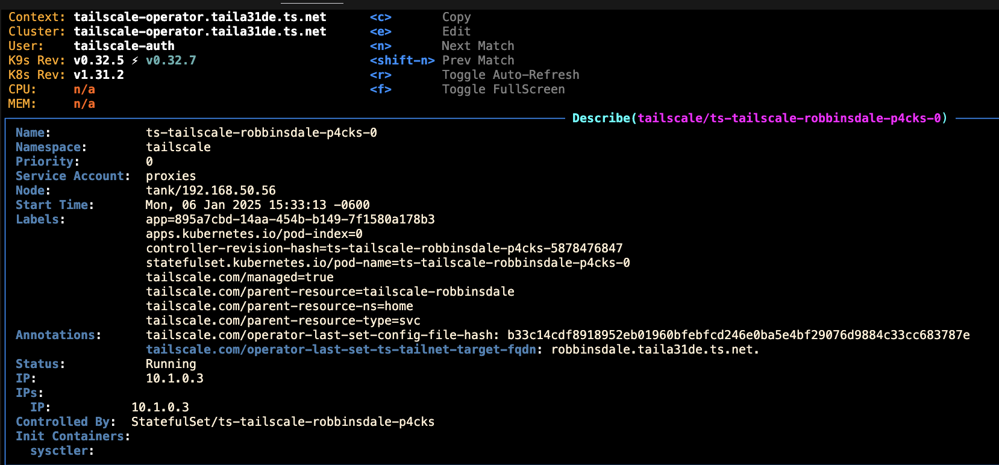
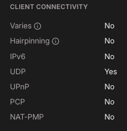

The **Tailscale Kubernetes Operator** enables seamless integration between Kubernetes clusters and Tailscale's secure networking capabilities. In this deep dive, I'll explore how to use the operator to manage Tailscale connectivity in a Kubernetes environment.

Live Kubernetes manifests for this setup can be found in my [GitHub repository](https://github.com/rajsinghtech/kubernetes-manifests/tree/main/clusters/talos-robbinsdale/apps/tailscale).

## How Tailscale Works

Before diving into the operator specifics, it's helpful to understand how Tailscale works. Tailscale creates a secure mesh network using WireGuard for encrypted tunnels between nodes. Instead of traditional hub-and-spoke VPN architecture, Tailscale enables direct peer-to-peer connections between nodes where possible, falling back to DERP (Designated Encrypted Relay for Packets) servers when direct connections aren't possible.

## Installation

Before we can use any of the Tailscale features, we need to install the operator.

Please follow the [Tailscale Kubernetes Operator Installation Guide](https://tailscale.com/kb/1236/kubernetes-operator) for more details.

## API Server Proxy

One of the most powerful features of the Tailscale Kubernetes Operator is the **API Server Proxy**. This allows you to securely expose your Kubernetes control plane (`kube-apiserver`) over Tailscale, eliminating the need for external management tools like Rancher.

### Setting up API Server Access

1. **Configure Tailscale ACLs**

   First, we need to set up appropriate access controls in the Tailscale ACLs:

   ```json
   {
     "grants": [
       {
         "src": ["autogroup:admin"],
         "dst": ["tag:k8s-operator"],
         "app": {
           "tailscale.com/cap/kubernetes": [
             {
               "impersonate": {
                 "groups": ["system:masters"]
               }
             }
           ]
         }
       },
       {
         "src": ["autogroup:member"],
         "dst": ["tag:k8s-operator"],
         "app": {
           "tailscale.com/cap/kubernetes": [
             {
               "impersonate": {
                 "groups": ["tailnet-readers"]
               }
             }
           ]
         }
       }
     ]
   }
   ```

   This configuration:
   - Grants admin users (`autogroup:admin`) full cluster access via the `system:masters` group
   - Gives regular users (`autogroup:member`) read-only access through the `tailnet-readers` group
   - Uses Tailscale's built-in group impersonation for RBAC integration

2. **Set up RBAC for Read-only Access**

   Create a `ClusterRoleBinding` for the read-only group:

   ```yaml
   apiVersion: rbac.authorization.k8s.io/v1
   kind: ClusterRoleBinding
   metadata:
     name: tailnet-readers-view
   roleRef:
     apiGroup: rbac.authorization.k8s.io
     kind: ClusterRole
     name: view
   subjects:
     - kind: Group
       name: tailnet-readers
       apiGroup: rbac.authorization.k8s.io
   ```

3. **Configure kubectl**

   Set up your local kubectl configuration:

   ```bash
   tailscale configure kubeconfig tailscale-operator.your-tailnet.ts.net
   ```

Once configured, you can securely access your cluster from anywhere in your tailnet:


## Egress Configuration

The operator enables pods within your cluster to access resources in your tailnet through Tailscale's secure mesh network.

Here's an example of exposing a Tailscale node to your cluster:

```yaml
apiVersion: v1
kind: Service
metadata:
  annotations:
    tailscale.com/tailnet-fqdn: robbinsdale.taila31de.ts.net
  name: tailscale-robbinsdale
  namespace: home
spec:
  externalName: placeholder   # The operator will update this
  type: ExternalName
```

The operator creates:
1. A StatefulSet running a Tailscale proxy pod
2. A Service that routes traffic through the proxy
3. A new node in your tailnet




You can verify the connectivity:

```bash
# Test SSH access
root@code-server-5fb56db484-f7wg5:/# ssh root@tailscale-robbinsdale.home

# Test network connectivity
root@code-server-5fb56db484-f7wg5:/# ping tailscale-robbinsdale.home -c 2
PING ts-tailscale-robbinsdale-p4cks.tailscale.svc.cluster.local (10.1.0.3) 56(84) bytes of data.
64 bytes from ts-tailscale-robbinsdale-p4cks-0.ts-tailscale-robbinsdale-p4cks.tailscale.svc.cluster.local (10.1.0.3): icmp_seq=1 ttl=61 time=0.522 ms
64 bytes from ts-tailscale-robbinsdale-p4cks-0.ts-tailscale-robbinsdale-p4cks.tailscale.svc.cluster.local (10.1.0.3): icmp_seq=2 ttl=61 time=0.461 ms
```

## Subnet Routing

The Tailscale Connector resource allows you to advertise cluster subnets to your tailnet, enabling seamless access to cluster resources.

```yaml
apiVersion: tailscale.com/v1alpha1
kind: Connector
metadata:
  name: robbinsdale-connector
spec:
  tags:
    - tag:k8s
  hostname: robbinsdale-connector
  subnetRouter:
    advertiseRoutes:
      - "192.168.50.0/24" # Local network
      - "10.0.0.0/16"     # Pod CIDR
      - "10.1.0.0/16"     # Service CIDR
      - "10.69.0.0/16"    # LoadBalancer CIDR
  exitNode: false
```

The Connector creates a Tailscale node that routes traffic between your tailnet and the advertised subnets:


### Auto-approving Routes

To automatically approve subnet routes, add this to your Tailscale ACLs:

```json
"autoApprovers": {
    "routes": {
        "192.168.50.0/24": ["tag:k8s", "autogroup:admin"],
        "10.0.0.0/16": ["tag:k8s", "autogroup:admin"],
        "10.1.0.0/16": ["tag:k8s", "autogroup:admin"],
        "10.69.0.0/16": ["tag:k8s", "autogroup:admin"]
    }
}
```

## Advanced Topics

### Pod Security and Privileges

The Tailscale operator requires privileged access to configure networking. To allow this in namespaces with Pod Security Policies:

```yaml
kind: Namespace
apiVersion: v1
metadata:
  name: tailscale
  labels:
    pod-security.kubernetes.io/enforce: privileged
  annotations:
    argocd.argoproj.io/sync-options: Prune=false
```

### Network Analysis

Using Hubble, we can observe the Tailscale traffic patterns:
We can see the UDP flows to the world outbound to other Tailscale nodes, as well as the connections to the Tailscale Coordination servers over HTTPS.


### NAT Behavior

The Connector pod operates in EasyNAT mode, enabling direct UDP connections when possible:



```bash
rajs@macbook % tailscale ping robbinsdale-connector
pong from robbinsdale-connector (100.107.45.57) via 67.4.239.75:56786 in 33ms
```

This direct connectivity indicates successful NAT traversal without requiring DERP relay servers.

## References

- [How Tailscale Works](https://tailscale.com/blog/how-tailscale-works)
- [Kubernetes Operator Documentation](https://tailscale.com/kb/1236/kubernetes-operator)
