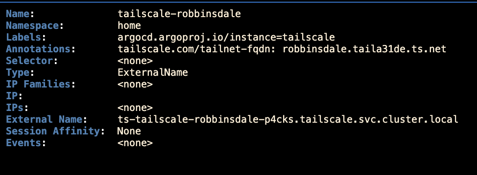
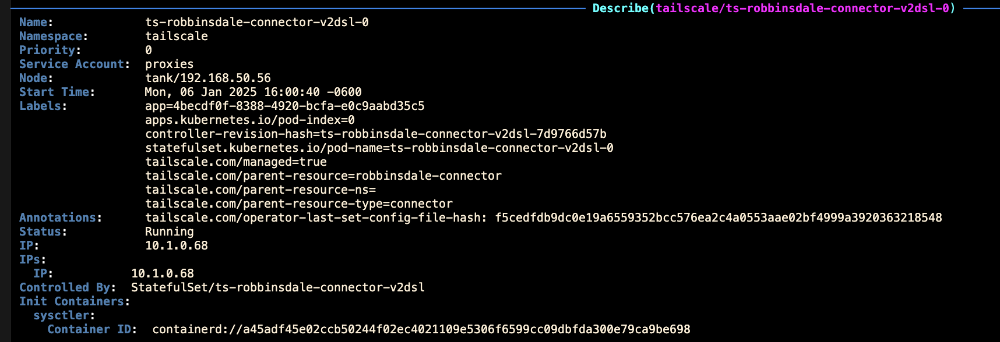
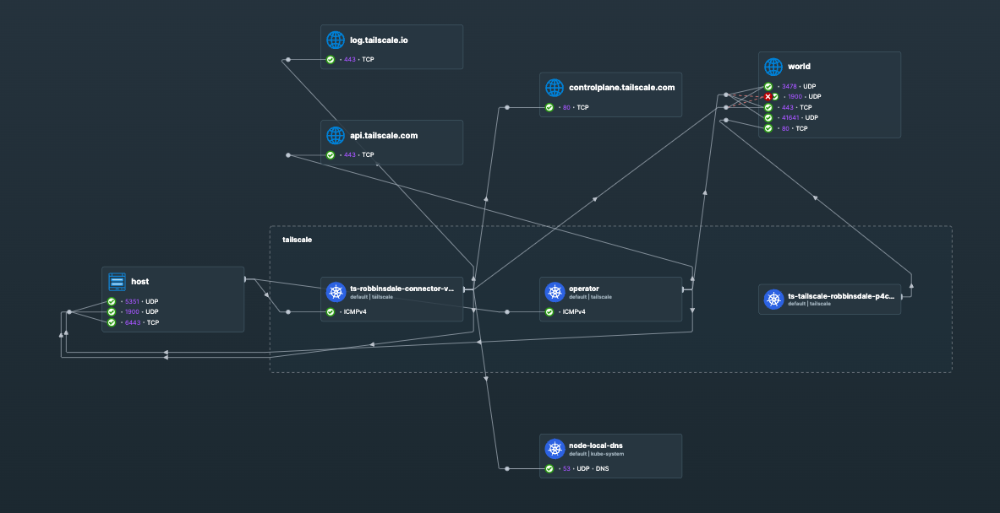

In this post, I will be discussing the **Tailscale Kubernetes Operator**, and how it can be used to manage Tailscale in a Kubernetes cluster. 

Live Kubernetes manifests can be found [here](https://github.com/rajsinghtech/kubernetes-manifests/tree/main/clusters/talos-robbinsdale/apps/tailscale).

## API Server Proxy

The Tailscale Kubernetes Operator includes an **API Server Proxy** that enables you to expose and access the Kubernetes control plane (`kube-apiserver`) over Tailscale. This is a great feature that negates the need for external management tools like Rancher.

[Learn more](https://tailscale.com/kb/1437/kubernetes-operator-api-server-proxy).

In my case, I have the API Server Proxy enabled and configured to use the `auth` mode. This allows me to configure granular Kubernetes RBAC permissions for individual tailnet users or groups.

### Configuring RBAC

1. **Add the following to your Tailscale ACL:**

   ```json
   {
     "grants": [
       {
         "src": ["autogroup:admin"],
         "dst": ["tag:k8s-operator"],
         "app": {
           "tailscale.com/cap/kubernetes": [
             {
               "impersonate": {
                 "groups": ["system:masters"]
               }
             }
           ]
         }
       },
       {
         "src": ["autogroup:member"],
         "dst": ["tag:k8s-operator"],
         "app": {
           "tailscale.com/cap/kubernetes": [
             {
               "impersonate": {
                 "groups": ["tailnet-readers"]
               }
             }
           ]
         }
       }
     ]
   }
   ```

   This configuration grants users in the `autogroup:admin` group access to impersonate the `system:masters` group in Kubernetes, giving them full administrative privileges. Regular members in `autogroup:member` are granted access to the `tailnet-readers` group, allowing them read-only access as defined by Kubernetes RBAC.

2. **Create a `ClusterRoleBinding` for the `tailnet-readers` group:**

   ```yaml
   apiVersion: rbac.authorization.k8s.io/v1
   kind: ClusterRoleBinding
   metadata:
     name: tailnet-readers-view
   roleRef:
     apiGroup: rbac.authorization.k8s.io
     kind: ClusterRole
     name: view
   subjects:
     - kind: Group
       name: tailnet-readers
       apiGroup: rbac.authorization.k8s.io
   ```

3. **Configure your kubeconfig to use the Tailscale API Server Proxy:**

   ```bash
   tailscale configure kubeconfig tailscale-operator.your-tailnet.ts.net
   ```

   Replace `tailscale-operator.your-tailnet.ts.net` with the MagicDNS name of your Tailscale operator node.

Now, you can use the `kubectl` command to interact with your Kubernetes cluster over Tailscale!


## Egress

The Tailscale Kubernetes Operator supports **Egress**, which allows you to route traffic from your cluster to other destinations in your tailnet.

In this example, I have created a `Service` that routes traffic to the `robbinsdale.your-tailnet.ts.net` Tailscale MagicDNS name.

```yaml
apiVersion: v1
kind: Service
metadata:
  annotations:
    tailscale.com/tailnet-fqdn: robbinsdale.taila31de.ts.net
  name: tailscale-robbinsdale
  namespace: home
spec:
  externalName: placeholder   # any value - will be overwritten by operator
  type: ExternalName
```


The operator schedules a `StatefulSet` that acts as a proxy, routing traffic to the specified MagicDNS name.





Now, we have a pod that is able to access the `robbinsdale.your-tailnet.ts.net` Tailscale MagicDNS name:

```bash
root@code-server-5fb56db484-f7wg5:/# ssh root@tailscale-robbinsdale.home
The authenticity of host 'tailscale-robbinsdale.home (10.1.0.3)' can't be established.
ED25519 key fingerprint is SHA256:Zv7nqSSrTgYQSsjGeDi/Y/XCfvW9bUDBnabYb1c2sgw.
This key is not known by any other names.
Are you sure you want to continue connecting (yes/no/[fingerprint])? yes
Warning: Permanently added 'tailscale-robbinsdale.home' (ED25519) to the list of known hosts.
root@tailscale-robbinsdale.home's password: 

root@code-server-5fb56db484-f7wg5:/# ping tailscale-robbinsdale.home -c 2
PING ts-tailscale-robbinsdale-p4cks.tailscale.svc.cluster.local (10.1.0.3) 56(84) bytes of data.
64 bytes from ts-tailscale-robbinsdale-p4cks-0.ts-tailscale-robbinsdale-p4cks.tailscale.svc.cluster.local (10.1.0.3): icmp_seq=1 ttl=61 time=0.522 ms
64 bytes from ts-tailscale-robbinsdale-p4cks-0.ts-tailscale-robbinsdale-p4cks.tailscale.svc.cluster.local (10.1.0.3): icmp_seq=2 ttl=61 time=0.461 ms

--- ts-tailscale-robbinsdale-p4cks.tailscale.svc.cluster.local ping statistics ---
2 packets transmitted, 2 received, 0% packet loss, time 1001ms
rtt min/avg/max/mdev = 0.461/0.491/0.522/0.030 ms
```

## Subnet Routing

The Tailscale Kubernetes Operator allows you to advertise cluster subnets to your tailnet using a `Connector` resource.

In this example, I have created a `Connector` that advertises the Local, Pod, Service, and LoadBalancer subnets.

``` yaml
apiVersion: tailscale.com/v1alpha1
kind: Connector
metadata:
  name: robbinsdale-connector
spec:
  tags:
    - tag:k8s
  hostname: robbinsdale-connector
  subnetRouter:
    advertiseRoutes:
      - "192.168.50.0/24" # Local
      - "10.0.0.0/16" # Pod
      - "10.1.0.0/16" # Service
      - "10.69.0.0/16" # LoadBalancer
  exitNode: false
```


The result is a device in my tailnet that exposes these subnets.




Now, I can reach any resource within my local network and Kubernetes cluster from anywhere in my tailnet!

```bash 
rajs@macbook:/# ping 192.168.50.1 -c 2
PING 192.168.50.1 (192.168.50.1) 56(84) bytes of data.
64 bytes from 192.168.50.1: icmp_seq=1 ttl=64 time=0.022 ms
64 bytes from 192.168.50.1: icmp_seq=2 ttl=64 time=0.022 ms

--- 192.168.50.1 ping statistics ---
2 packets transmitted, 2 received, 0% packet loss, time 1001ms
rtt min/avg/max/mdev = 0.022/0.022/0.022/0.000 ms
```

Note: I added the `autoApprovers` field in my Tailscale ACL to automatically approve routes for the `tag:k8s` group.

```json
	"autoApprovers": {
		"routes": {
			"192.168.50.0/24": [
				"tag:k8s",
				"autogroup:admin",
			],
			"10.43.0.0/16": [
				"tag:k8s",
				"autogroup:admin",
			],
			"10.42.0.0/16": [
				"tag:k8s",
				"autogroup:admin",
			],
			"10.96.0.0/16": [
				"tag:k8s",
				"autogroup:admin",
			],
		},
	},
```


## Notables

### Namespace Privilege Escalation

Within the operator, I noticed it was being denied the ability to run privileged containers due to Pod Security Policies.

``` 
{"level":"info","ts":"2025-01-06T21:27:36Z","logger":"KubeAPIWarningLogger","msg":"would violate PodSecurity \"restricted:latest\": privileged (containers \"sysctler\", \"tailscale\" must not set securityContext.privileged=true), allowPrivilegeEscalation != false (containers \"sysctler\", \"tailscale\" must set securityContext.allowPrivilegeEscalation=false), unrestricted capabilities (containers \"sysctler\", \"tailscale\" must set securityContext.capabilities.drop=[\"ALL\"]), runAsNonRoot != true (pod or containers \"sysctler\", \"tailscale\" must set securityContext.runAsNonRoot=true), seccompProfile (pod or containers \"sysctler\", \"tailscale\" must set securityContext.seccompProfile.type to \"RuntimeDefault\" or \"Localhost\")"}
```

To resolve this, I updated the namespace to allow privileged containers:

```yaml
kind: Namespace
apiVersion: v1
metadata:
  name: tailscale
  labels:
    pod-security.kubernetes.io/enforce: privileged
  annotations:
    argocd.argoproj.io/sync-options: Prune=false
```


### Hubble Flows

In Tailscale, we can see the UDP flows to the world as well as the connections to the Tailscale Coordination servers over HTTPS.

